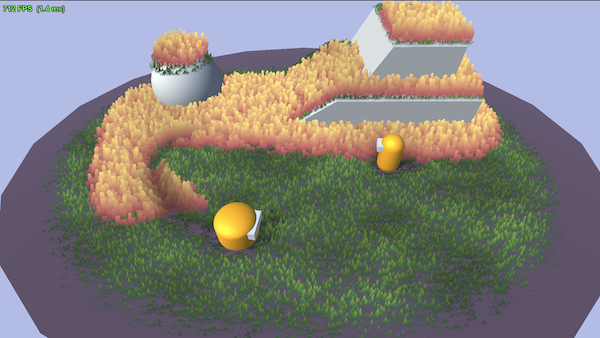
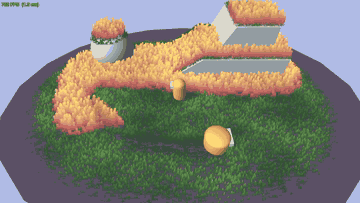

# Unity Grass Spawner

## Documentation

- [Web demo & download on itch.io](https://nminhhoangit.itch.io/unity-grass-spawner)
- [Source on GitHub](https://github.com/nminhhoangit/unity-grass-spawner)

## Overview

Stylized, interactive grass built for **WebGL and mobile first**, with PC features you switch on.
Works in **URP** (forward, cast + receive shadows, depth, depth-normals) and **Built-in** (forward, shadow casting).

- Baked static chunk meshes: one or two draw calls per chunk, zero per-frame CPU for the grass itself.
- No compute shaders, no GPU instancing, no geometry shaders. Single alpha-clipped pass.
- Wind, camera-facing, distance fade, interaction, trails and shading all run in the vertex shader.
- Everything is edited on one component with Scene-view handles and live preview. Fields that don't apply to the current mode are hidden.

---

## Requirements

Unity 6000.x. URP 17 is optional and auto-detected through the `RenderPipeline` SubShader tag. The UGUI package is needed by FpsDisplay and GrassRuntimeUI.

The package folder can be moved or renamed: nothing in the code depends on its path.

---

## Quick start

1. **GameObject > 3D Object > Grass Field.** A spawner appears with the default material and blade texture.
2. Set **Area** (drag the edge handles, or switch to Spline and drag points), set **Density**, click **Rebuild Grass**.
3. Add a **Grass Interactor** to anything that should push grass (player, ball). Drive it with **TweenPosition** for a quick demo.
4. Pick a quality preset with the two buttons at the bottom of the inspector:
   - **Mobile / WebGL** (default): 40k blades, 1 segment, unlit, no shadows, short culling.
   - **PC**: 250k blades, 2 segments, lit, cast + receive shadows, long culling, 512 trample map.
5. Decide on **Build On Start**:
   - **On**: grass is rebuilt when the scene starts. The editor preview is temporary but is restored automatically after Play mode or a scene reload.
   - **Off**: click Rebuild in the editor and the grass is **baked into the scene** (chunks saved, meshes stored in the package's `Baked` folder). Zero load-time cost, deterministic in builds.

The **Demo** scene shows two fields on a platform and a boulder, two movers with interactors, the FPS overlay, the runtime toggle panel and the parallax camera.

---

## GrassSpawner reference (inspector order)

### Input
| Field | Meaning |
|---|---|
| Blade Texture | PNG whose alpha is the blade shape. White silhouettes work best. Enable *Alpha Is Transparency* on the import settings to avoid dark fringes (the shader also un-premultiplies as a safety net). |
| Tint Map | Optional texture spread over the area bounds; multiplies the grass color (dry patches, paths). |
| Tint Map Tiling / Offset | Repeats across the area (set the texture to Repeat for tiling above 1) and shifts it. |
| Tint Map Color | Multiplied into the map: recolor a grayscale mask without editing the texture. |
| Tint Map Strength / Blur | Strength blends toward white; blur samples a higher mip level (needs mipmaps). |
| Base Material | Only the shader is taken from it. Every look setting lives on the spawner. |

### Area
| Field | Meaning |
|---|---|
| Area Shape | **Rectangle** (drag the four edge handles) or **Spline** (closed Catmull-Rom through the points; Shift+click the curve to add, Ctrl/Cmd+click a point to remove). |
| Area Size | Rectangle size, centered on the transform. |
| Spline Points / Smoothness | Control points in local XZ; 0 = straight polygon, 1 = fully smooth. Reset buttons for a rectangle or a circle. |
| Edge Falloff / Edge Density / Edge Height | Soft boundary: over this width the density fades to *Edge Density* and blades shrink to *Edge Height*. 0 = hard edge. |

### Color
Color is defined **on the spawner**, not on the material.
| Field | Meaning |
|---|---|
| Color Mode | **Gradient** (root to tip) or **Solid**. The gradient is baked into a 64x1 ramp texture; changes preview instantly. |
| Gradient Mode | **BladeHeight**: the ramp follows real height, so short blades stay in root colors and the field reads as one surface. **CardUV**: every card runs root to tip over its own length (Zelda style). |
| Use Texture Color | Multiply the PNG's RGB in. Off by default so pre-shaded sprites don't bake their shadows into every blade. |

### Ground Blend
| Field | Meaning |
|---|---|
| Blend To Ground | Fades the base of each blade into the ground so roots don't draw a hard line on the terrain. |
| Ground Blend Mode | **AlphaFade**: the root becomes fully transparent (alpha 0) with a per-pixel noise dither, still one cutout pass. **Color**: at Rebuild the surface under **each blade** is sampled (material color x texture when readable, terrain layers weighted by paint) and baked into the mesh (+4 bytes per vertex), so every patch of ground gets its own root color. Rebuild after changing ground materials or terrain paint. |
| Ground Blend Height / Strength | How far up the ramp the blend reaches, and how strong it is. |

### Shading
Per-blade variation, light influence (0 = flat colors, 1 = fully follows the main light color, intensity and scene ambient), wind highlight, trample darkening. Only used when *Affected By Lighting* is on (except variation and trample darkening).

### View
| Field | Meaning |
|---|---|
| Optimize For Perspective | Cards align to the camera view direction as one plane (no per-blade swivel) and lean away from a camera looking down. One card per blade is enough, so *Cross Quads* is ignored while on. |

### Wind
Direction on XZ, strength, speed, spatial frequency. Motion has a per-blade random phase; shading uses a coherent wave so light bands travel smoothly across the field.

### Interaction
| Field | Meaning |
|---|---|
| Push Strength | How far interactors push blades aside. |
| Trample Recovery | A small render texture per spawner remembers where interactors passed; grass stays flat and springs back over *Recovery Time*. One cheap blit per frame, skipped when idle or off-screen. Each interactor can scale the recovery time. |
| Trample Map Resolution | Default 256. Needs Rebuild to change. |

### Density
Blades per square meter, a hard cap, and a seed.

### Density Mask
| Field | Meaning |
|---|---|
| Density Mask | Texture over the area bounds; the chosen channel (with optional invert) scales local density. Needs **Read/Write enabled**. |
| Use Terrain Layer | When the ground is a Unity Terrain, the weight of one paint layer scales density (index + influence). |

### Lighting
| Field | Meaning |
|---|---|
| Affected By Lighting | **Off by default** (unlit, colors exactly as set). On: main light direction, color, intensity and scene ambient shade the grass per vertex. |
| Cast Shadows | ShadowCaster pass (URP and Built-in). One extra pass per cascade; the PC preset turns it on. |
| Receive Shadows / Shadow Strength | **URP only.** One main-light shadow tap per vertex. Not compatible with the *Screen Space Shadows* renderer feature. |

### Blade Shape
| Field | Meaning |
|---|---|
| Height Range / Width Range | Random per blade. |
| Cross Quads | Two cards at 90 degrees per blade. Ignored while *Optimize For Perspective* is on. |
| Segments | Vertical subdivisions per card; 1 is cheapest, 2-3 bend more smoothly. |

### Ground
Raycast down onto *Ground Layers* from *Raycast Height*; blades sit on whatever they hit (terrain, meshes, props). Steeper than *Max Slope* is skipped. No hit = spawner plane.

### Chunking and Camera Culling
| Field | Meaning |
|---|---|
| Chunk Size | Chunk edge in meters. Smaller = finer culling, more draw calls. |
| Camera Culling | Per frame: hide chunks outside the frustum or beyond *Max Distance* (blades shrink into the ground over *Fade Range* so nothing pops), and drop the detail half of chunks beyond *Detail Distance* (density LOD). *Culling Camera* empty = Camera.main. |

### Runtime
| Field | Meaning |
|---|---|
| Build On Start | See Quick start. Off = baked into the scene. |

---

## Other components

**GrassInteractor** - a sphere that pushes grass. *Radius*, *Offset*, *Strength* (how flat), *Recovery Scale* (multiplies the spawner's Recovery Time; heavy objects leave longer trails). Up to 8 active at once.

**GrassRuntimeUI** (Utils) - runtime toggle panel (UGUI) to compare cost on device: lighting, cast / receive shadows, perspective, wind, ground blend, trample recovery, plus a camera section (mouse parallax, drag to orbit, scroll to zoom) when a CameraParallax exists. Creates its own canvas and EventSystem if needed.

**TweenPosition** (Utils) - moves a Transform along a closed or open spline at constant speed; Local or World space points, Loop or PingPong, duration per lap, scene-view handles, kinematic rigidbody support.

**TweenRotation** (Utils) - loops a rotation around an axis with quaternions (no Euler drift): Spin (one turn per Duration) or PingPong (swing between -Angle and +Angle), Local or World axis, optional easing.

**CameraParallax** (Utils) - mouse / touch parallax around a focus point (Offset or Orbit mode), drag to orbit (yaw and pitch toggles, elevation limits, ignores drags that start on UI), mouse-wheel / pinch dolly zoom.

**FpsDisplay** (Utils) - FPS and frame time on a UGUI Text, optional grass stats.

---

## Performance notes

- Budget: 30k-60k blades for WebGL / mid mobile, 200k+ on PC. The inspector shows vertex count and GPU MB before you build.
- Each vertex is 36 bytes (40 with baked ground colors); a blade is 4 vertices (1 segment, 1 card). Cross quads double it; each extra segment adds 2 vertices per card.
- Chunk culling is per renderer; keep chunks around 10-20 m for a good culling / draw-call balance.
- Many spawners cost nothing extra per frame beyond their own chunks: shader globals are uploaded once, trample blits are skipped when nothing changed.
- Baked mode keeps a CPU copy of the meshes (needed for serialization); preview / Build On Start mode frees it after upload.
- Dynamic batching is disabled on the shader on purpose: blades are rebuilt from object-space data.

## Known limitations

- Received shadows are URP only and per vertex; Built-in receives none. Only the main directional light lights the grass.
- No HDRP SubShader.
- Textures used as Density Mask must be readable; they are sampled on the CPU at build time only.
- Recovery time per trail is capped at 60 s.
- The AlphaFade ground blend is a dither: visible as fine grain very close up; MSAA smooths it.
